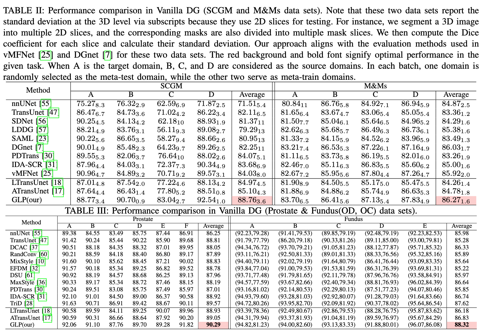
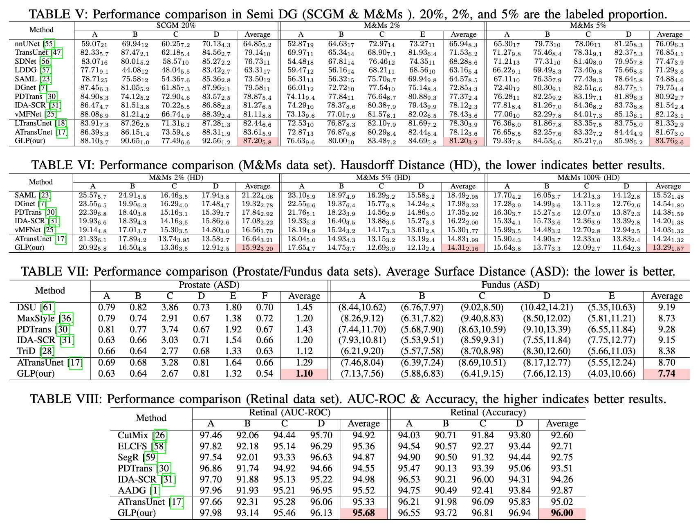

<h1 align="center"> Enhancing Domain Generalization in Medical Image Segmentation with Global and Local Prompts </h1>

## About Our Work

Update: 2025/07/15: We have created a repository for the paper titled *Enhancing Domain Generalization in Medical Image Segmentation with Global and Local Prompts*, which has been accepted by the **IEEE Transactions on Neural Networks and Learning Systems**. In this repository, we offer the original sample datasets, preprocessing scripts, and algorithm files to showcase the reproducibility of our work.


## Requirements

- Python == 3.8.17
- Pytorch == 1.31.1
- SimpleITK== 2.3.0
- scikit-learn== 1.3.0
- opencv-python== 4.8.0.76
- torchnet== 0.0.4

## Data Sets

The structure of the data set should be like

```
data
|_ ProDataset
|  |_ BIDMC
|  |_ BMC
|  |_ HK
|  |_ I2CVB
|  |_ RUNMC
|  |_ UCL
|_ SCMDataset
|_ |_ ...
|_ OpenDataset
|_ |_ ...
|_ RetinalDataset
|_ |_ ...
```

Due to the copyright limitations, we have not uploaded the data.  You can seek permission from the organizer according to the link given or download it directly from their website.

[Prostate Dataset](https://liuquande.github.io/SAML/)

[M\&Ms Dataset](https://www.ub.edu/mnms/)

[SCGM Dataset](https://www.sciencedirect.com/science/article/pii/S1053811917302185/)

[Retinal Dataset](https://paperswithcode.com/task/retinal-vessel-segmentation)

[Fundus Dataset](https://zenodo.org/records/8009107)

## RUN

You need to first change the dirs in the scripts of preprocess folder. Download the M&Ms data and run `split_MNMS_data.py` to split the original dataset into different domains. Then run `save_MNMS_2D.py` to save the original 4D data as 2D numpy arrays. Finally, run `save_MNMS_re.py` to save the resolution of each datum.

```powershell
# unzip all files into the Medical directory
# preprocess if SCGM/MM (OpenDataset) dataset
python split_MNMS.py
python save_MNMS_2D.py
# run
python main.py # main file: M&M->main.py, SCGM->main_scm.py, Prostate->main_pro.py...
```

## Main Comparison





## Citation

We will provide updates once the arXiv/TNNLS publication process is complete.

## Contributors ✨

Many thanks to the data preprocessing pipeline in the following published papers.

[DGNet-MICCAI'21](https://github.com/vios-s/DGNet/tree/main)；[AADG-TMI'22](https://github.com/CRazorback/AADG/tree/main); [TriD-MICCAI'23](https://github.com/Chen-Ziyang/TriD/tree/main/TriD-master/PROSTATE)

You can contact czhaobo@connect.ust.hk for more guidance and collaboration!
